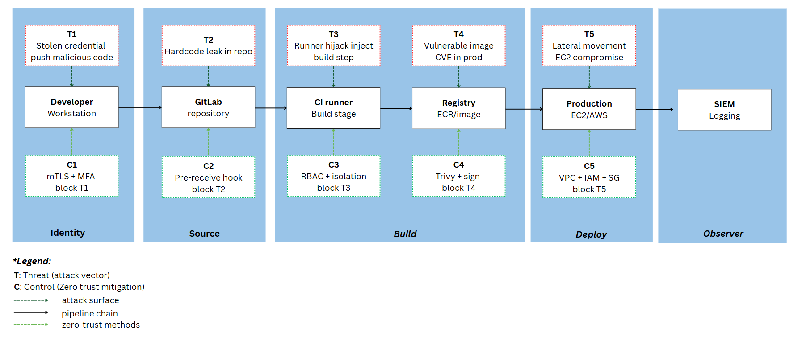
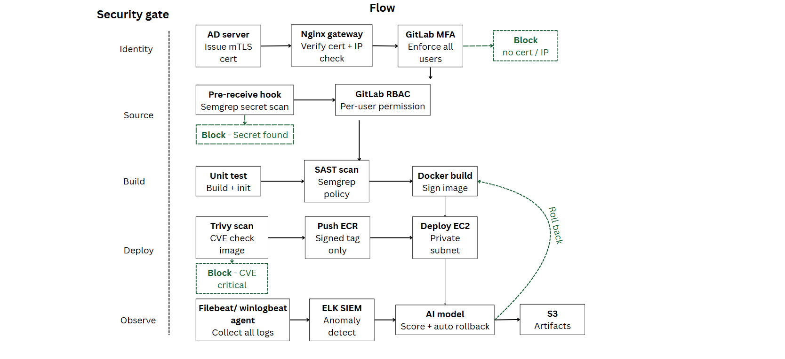
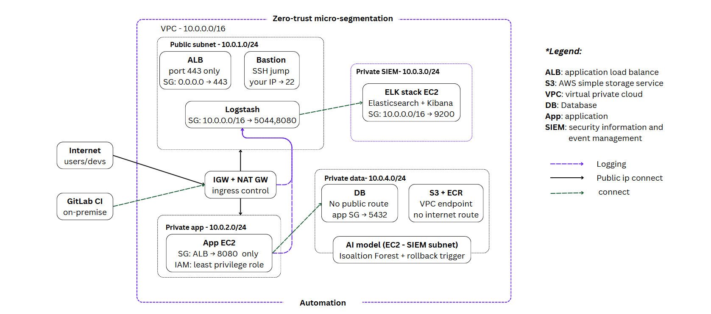
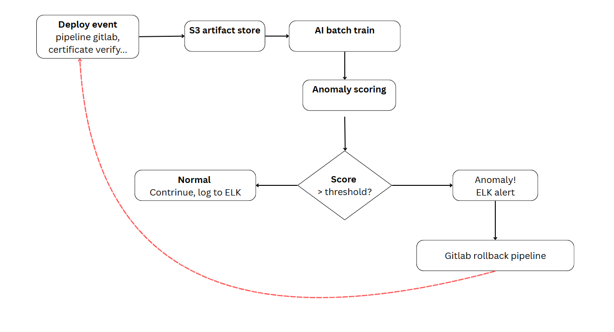
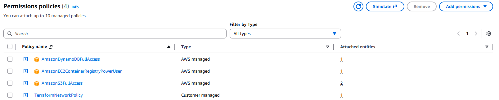

# Zero-trust and AI-driven in devsecops pipeline

> A production-ready graduation thesis project focused on designing a Zero-Trust system and providing an AI-driven mechanism to control and automatically roll back CI/CD pipelines when anomalies are detected in system logs.

---

## Table of Contents

- [Prerequisites](#prerequisites)
- [Architecture Overview](#architecture-overview)
- [Infrastructure Configuration](#infrastructure-configuration)
  - [AD and CA Server Setup](#adca-setup)
  - [Gitlab Server Setup](#vm-setup)
  - [Automation with Terraform Setup](#elk-cluster-configuration)
  - [Cloud Account Setup (AWS)](#cloud-account-setup-aws)
- [Network & Security Configuration](#network--security-configuration)
- [Log Pipeline Configuration](#log-pipeline-configuration)
- [Troubleshooting](#troubleshooting)
- [Contributing](#contributing)

---
## Architecture Overview





## Prerequisites

Before proceeding with the setup, ensure all of the following infrastructure components are provisioned and accessible.

### Minimum Infrastructure Requirements

#### Virtual Machines (Minimum: 4 VMs on-premise (`vm-server-01`, `vm-server-02`, `vm-dev-01`, `vm-dev-02`))

You must provision **at least 7 VMs** with the following roles:

| VM | Role | Min CPU | Min RAM | Min Disk | OS |
|----|------|---------|---------|----------|----|
| `vm-server-01` | AD and CA Server | 2 vCPU | 4 GB | 40 GB | Window server 2022 |
| `vm-server-02` | Gitlab Server | 2 vCPU | 8 GB | 80 GB | Ubuntu 22.04 LTS |
| `vm-elk-01` | Elasticsearch, Kibana | 4 vCPU | 8 GB | 100 GB | Ubuntu 22.04 LTS |
| `vm-elk-02` | Logstash | 4 vCPU | 8 GB | 80 GB | Ubuntu 22.04 LTS |
| `vm-app-01` | Application 1| 1 vCPU | 4 GB | 40 GB | Ubuntu 22.04 LTS |
| `vm-app-02` | Application 2| 1 vCPU | 4 GB | 40 GB | Ubuntu 22.04 LTS |
| `vm-dev-01` | Developer | 2 vCPU | 4 GB | 80 GB | Window 11 |
| `vm-dev-02` | Developer | 2 vCPU | 4 GB | 80 GB | Window 11 |

> **Note:** VMs `vm-elk-01` and `vm-elk-02` form the **dedicated ELK logging cluster** (2 VMs). The remaining VMs host your application workloads and developer(dev) join, test.

#### Public Cloud Account (Recommended: AWS)

You must have **at least one active public cloud account**. AWS is the recommended provider for this setup.

---
### Minimum required AWS services


- **Amazon EC2** — For provisioning cloud-based virtual machines to run applications and services (optional but recommended for scalability and control).

- **Amazon S3** — For long-term log archiving, backup storage, and Elasticsearch snapshot management.

- **AWS Identity and Access Management (IAM)** — For fine-grained access control, role-based permissions, and secure service-to-service authentication.

- **Amazon VPC** — For network isolation, custom IP addressing, and secure infrastructure design.

- **Security Groups** — For instance-level firewall rules controlling inbound and outbound traffic.

- **Elastic Load Balancing (ALB/NLB)** — For distributing incoming traffic across multiple instances to ensure high availability and fault tolerance.

- **Route Tables** — For controlling traffic flow within the VPC and defining routing policies.

- **Internet Gateway (IGW)** — For enabling communication between VPC resources and the public internet.

- **NAT Gateway** — For allowing instances in private subnets to access the internet securely without exposing them directly.

- **AWS Network Firewall** — For advanced network-level traffic filtering, monitoring, and intrusion prevention.


## Infrastructure Configuration

This section provides an overview of the infrastructure setup. Detailed step-by-step instructions are documented in the corresponding guide files.


### AD and CA Server Setup

The setup process for Active Directory (AD) and Certificate Authority (CA) is documented in a separate guide.

Please refer to the detailed instructions here:  
`src\config\guides\P0_AD_CA.pdf`

Follow this official link to install **Winlogbeat**:  
 [https://www.elastic.co/docs/reference/beats/winlogbeat/winlogbeat-installation-configuration](https://www.elastic.co/docs/reference/beats/winlogbeat/winlogbeat-installation-configuration)

After installation, copy the Winlogbeat configuration file: `src/config/scripts/P0_winlogbeat` to the folder where you installed Winlogbeat, then restart the Winlogbeat service:

```powershell
Restart-Service winlogbeat
```


---
### GitLab Server Setup

The GitLab server provisioning and configuration steps are described below. Please ensure all required scripts and configuration files are prepared before starting.

#### 1. Run installation script

Copy the installation script: `src/config/scripts/P0_gitlab_server_install.sh`

Grant execute permission and run the script:

```bash
chmod +x P0_gitlab_server_install.sh
./P0_gitlab_server_install.sh
```

This step installs GitLab, NGINX, and Filebeat.

---

#### 2. Configure Filebeat

Copy the configuration file: `src/config/scripts/P0_filebeat.yml` to `/etc/filebeat/filebeat.yml`

Restart Filebeat service:

```bash
sudo systemctl restart filebeat.service
```

---

#### 3. Configure GitLab

Copy the configuration file: `src/config/scripts/src/config/scripts/P0_gitlab.rb`  to `/etc/gitlab/gitlab.rb`

Apply configuration:

```bash
sudo systemctl restart gitlab.slice gitlab-runsvdir.service
```

---

#### 4. Configure NGINX reverse proxy

Copy the configuration file:`src/config/scripts/P1_nginx_proxy`  to `/etc/nginx/sites-available/gitlab-frontend`

Restart NGINX:

```bash
sudo systemctl restart nginx.service
```

---

#### 5. Configure Git hooks (Semgrep)

Copy the hook script: `src/config/scripts/P1_pre-receive_hook.sh`  to `/opt/gitlab/embedded/service/gitlab-shell/hooks/pre-receive.d/semgrep.sh`


---

### ⚠️ Notes

- Update the Logstash server IP address in: `/etc/filebeat/filebeat.yml`  and folder that you install `winlogbeat`
- Configure the username and password in: `/etc/gitlab/gitlab.rb`
- Ensure the root CA certificate is installed before enabling authentication with Active Directory (AD).
- Verify that the certificate path configured in the NGINX file (`gitlab-frontend`) matches the actual certificate location used for AD integration.

---
